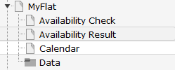
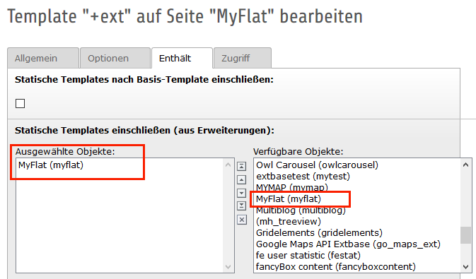
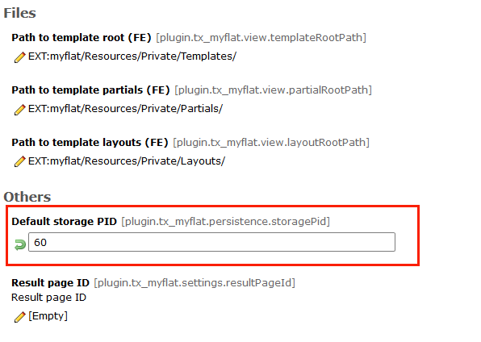
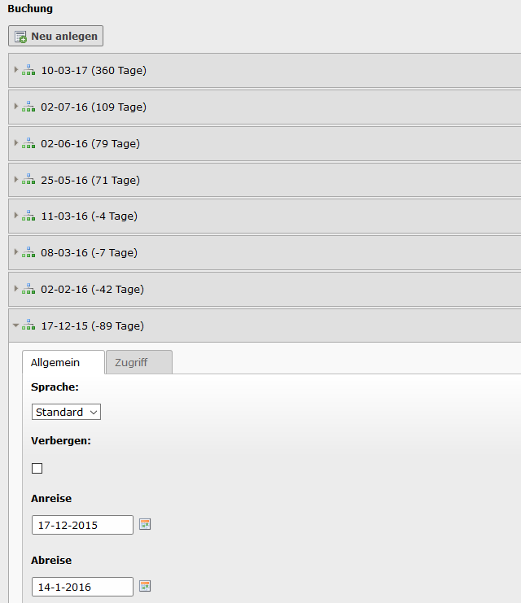

.. ==================================================
.. FOR YOUR INFORMATION
.. --------------------------------------------------
.. -*- coding: utf-8 -*- with BOM.

.. include:: ../Includes.txt

.. _admin-manual:

Administrator manual
====================

Target group: **Administrators**

Installation
^^^^^^^^^^^^
Import the extension from TER (TYPO3 Extension Repository) like any other extension.
Create some pages as shown below.

On the page Availability Form insert the plugins availability form. If you want the availability check result
on the same page then insert the plugin availibility check too and set resultPageId to this PageID.

On page Availability Result insert the plugin AvailibilityCheck.

On page Calendar insert the plugin multirowcalendar of the extension.

On page Myflat or on your root page insert Typoscript Include static (from extension) myflat.
With the constant editor insert the desired settings of the extension like include 
jQuery options, path to templates etc.

The data of the flats and categories is stored in page Data. Insert in the constant editor
the correct "Default storage PID" of the flats.

Inserting data
^^^^^^^^^^^^^^
In TYPO3 list module select page Data. First insert at least one flat category.
Then you can insert some flat locations.

To insert some booking data, go to the flat in the list module, select the desired flat and 
insert a new booking.

When everything is done you can see the flat on the page List. If only one flat is available you are redirected
to the monthmultirowcalendar view of the extension.

Reference
^^^^^^^^^

.. _plugin-tx-myflat:

plugin.tx\_myflat.view
^^^^^^^^^^^^^^^^^^^^^^

templateRootPath
""""""""""""""""

.. container:: table-row

   Property
         templateRootPath

   Data type
         string

   Description
         path to templates

   Default
         EXT:myflat/Resources/Private/Templates/

partialRootPath
""""""""""""""""

.. container:: table-row

   Property
         partialRootPath

   Data type
         string

   Description
         path to partials

   Default
         EXT:myflat/Resources/Private/Partials/
     
layoutRootPath
""""""""""""""

.. container:: table-row

   Property
         layoutRootPath

   Data type
         string

   Description
         path to layouts

   Default
         EXT:myflat/Resources/Private/Layouts/

     
plugin.tx\_myflat.persistence
^^^^^^^^^^^^^^^^^^^^^^^^^^^^^

storagePid
""""""""""

.. container:: table-row

   Property
         storagePid

   Data type
         string

   Description
         uid of storage folder, if more than one value sparate it by comma.

   Default
        0
    
resultPageId
""""""""""""

.. container:: table-row

   Property
        resultPageId

   Data type
         int

   Description
         Id of the availability check result page.

   Default
        -
         

Known problems
^^^^^^^^^^^^^^

... 
 

FAQ
^^^

*Custom templates and files*

You can use your own template and CSS file or other jQuery library - just go to the TYPO3 constants editor and change
the values for your needs.
