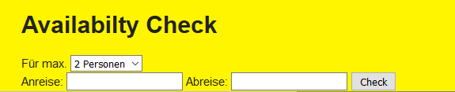

.. ==================================================
.. FOR YOUR INFORMATION
.. --------------------------------------------------
.. -*- coding: utf-8 -*- with BOM.

.. include:: ../Includes.txt

What does it do?
================

The extension shows the bookings of holiday flats in calendars. You can search for a flat with an availability check for a desired time period with
the extension.

What's new?
^^^^^^^^^^^

This is the first public release.
The configuration of the extension is done with the constant editor or with typoscript.

Screenshots
___________

**Availability form** 

**Availability result** 

Click on flat name will show the multirowcalendar.

    

**MultiRowCalendar2** 

.. image:: ../Images/Introduction/MultiRowCalendar2.png
	:width: 500px
	:alt: MultiRowCalendar
    
