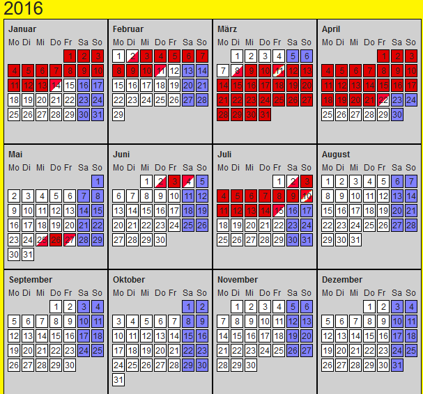

# myflat

#### Booking calender for holiday flats

What does it do
---------------

Shows the booking of holiday flats in calendars. An availability check is implemented too.

#### Plugin AjaxSearch with infoWindow

For details see [Introduction](https://github.com/joachimruhs/myflat/blob/master/Documentation/Introduction/Index.rst "Introduction")

For configuration and installation in detail, see the [Administrator Manual](https://github.com/joachimruhs/myflat/blob/master/Documentation/AdministratorManual/Index.rst "Administrator Manual")

